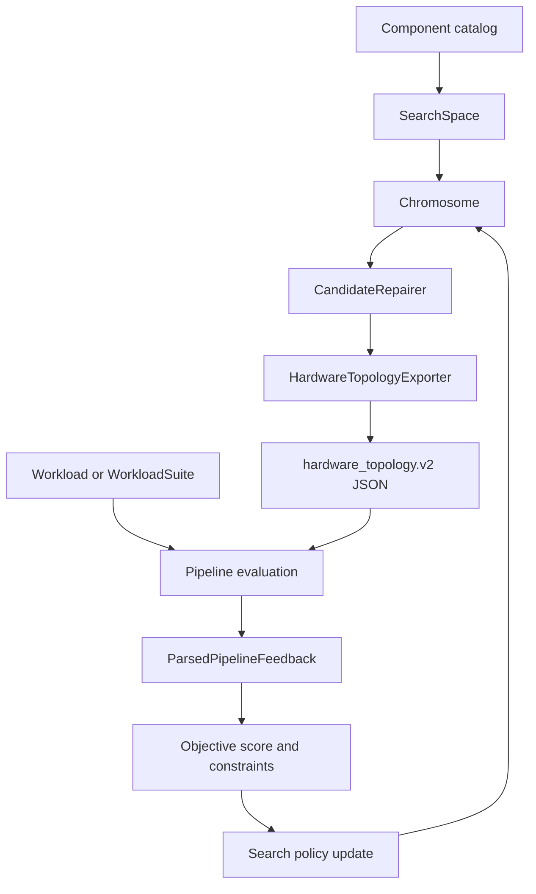

# Optimizer 算法、架构与实现说明

本文档说明 `optimizer` 模块的目标、整体架构、核心数据结构、评估闭环，以及当前实现的三类生产级搜索策略：约束感知进化搜索、TCRO 连续松弛搜索、TG-RL 图编辑强化学习搜索。文档基于当前源码结构编写，主要覆盖 `optimizer/src/codesign_optimizer/optimizer/` 下的实现。

## 1. 模块定位

`optimizer` 是一个硬件与软件协同设计优化器。它不直接修改 mapper 或 simulator 的内部语义，而是把候选硬件配置导出为 mapper/simulator 可消费的 `hardware_topology.v2`，再调用既有 mapper 到 simulator 的 wrapper 进行真实评估。优化器把 mapper/simulator 当作黑盒评估器，通过运行结果中的 makespan、链路拥塞、远端内存争用、队列延迟等 telemetry 来指导下一轮硬件候选生成。

当前模块同时保留了两层能力：

1. 旧版两阶段协同优化框架：`codesign-opt run`，围绕 `HardwareProposal`、`SoftwareMapper`、`SimulatorClient` 做外层硬件更新和内层软件映射。
2. 新版拓扑搜索框架：`codesign-opt search`、`codesign-opt tcro`、`codesign-opt tgrl`，围绕 `SearchSpace`、`Chromosome`、`HardwareTopologyExporter`、`MapperSimulatorPipelineClient` 做离散或连续松弛的硬件拓扑搜索。

新版搜索框架是当前主要实现路径。

## 2. 代码结构

```text
optimizer/src/codesign_optimizer
├── cli.py
├── config/settings.py
├── models
│   ├── feedback.py
│   ├── hardware.py
│   └── workload.py
├── optimizer
│   ├── chromosome.py
│   ├── constraints.py
│   ├── evolutionary.py
│   ├── exporter.py
│   ├── feedback_parser.py
│   ├── inner_loop.py
│   ├── objective.py
│   ├── orchestrator.py
│   ├── outer_loop.py
│   ├── pipeline_client.py
│   ├── repair.py
│   ├── search_space.py
│   ├── tcro.py
│   ├── tgrl.py
│   ├── tgrl_v2
│   │   ├── model.py
│   │   ├── observation.py
│   │   ├── ppo.py
│   │   └── trainer.py
│   └── workload_suite.py
└── simulator
    ├── file_adapter.py
    └── interface.py
```

关键入口如下。

| CLI 命令 | 主要类 | 说明 |
| --- | --- | --- |
| `codesign-opt run` | `CoDesignOrchestrator` | 旧版两阶段 loop，读取硬件、workload、sim feedback 文件，做映射和硬件增量更新。 |
| `codesign-opt search` | `HeuristicSearchRunner` | 约束感知进化搜索，使用 NSGA-II 排序和 telemetry 驱动变异。 |
| `codesign-opt tcro` | `TCROSearchRunner` | 连续松弛 supernet 搜索，采样离散候选，用 simulator telemetry 更新连续参数。 |
| `codesign-opt tgrl --mode v0` | `TGRLSearchRunner` | 基于启发式 telemetry prior 的 masked graph-edit 搜索。 |
| `codesign-opt tgrl --mode v1` | `TGRLSearchRunner` | 在 v0 基础上加入纯 Python 线性策略学习器。 |
| `codesign-opt tgrl --mode v2` | `TGRLPPOTrainer` | GNN actor-critic 加 PPO 的 graph-edit 强化学习搜索。 |

## 3. 总体架构

新版搜索路径共享同一个候选评估闭环。



各搜索算法的差异主要在 `Search policy update`：

- 进化搜索维护离散种群，用 mutation、crossover、NSGA-II 选择推进。
- TCRO 维护连续 supernet 参数，用 telemetry pseudo-gradient 更新 logits 和 alpha。
- TG-RL 维护离散状态，枚举合法 graph edit action，用启发式 prior 或 PPO 策略选择动作。

评估、修复、导出、缓存、mapper/simulator 调用、feedback 解析和目标函数计算是共享设计。

## 4. 核心数据模型

### 4.1 ComponentLibrary

实现位置：`models/hardware.py`。

`ComponentLibrary` 描述可用硬件组件，主要包含：

- `NodeTypeSpec`：节点类型。字段包括 compute 能力、memory 容量、power、cost、role、rack units、capacity、switch radix 等。
- `LinkTypeSpec`：链路类型。字段包括 bandwidth、latency、protocol、cost、lanes、technology、level、scope 等。

搜索算法不会硬编码某个 GPU、CPU、内存池或交换机型号，而是从 catalog 中推断类型池和约束。

### 4.2 SearchSpace

实现位置：`optimizer/search_space.py`。

`SearchSpace` 是拓扑搜索的配置根对象，包含：

- `templates`：初始 rack template。每个 template 由若干 `RackSpec` 组成。
- `archetypes`：可新增 rack 的原型，用于 TG-RL add-rack 和部分 mutation。
- `limits`：全局成本、功耗、rack 数量、rack 内功耗、rack units 等约束。
- `objective_weights`：makespan、cost、power、link utilization、queue delay、remote memory contention 的加权目标。
- `mutation`：进化搜索和图编辑中的链路数量范围、变异率、elite 比例、是否允许删除初始 rack 等。
- `evaluation`：mapper、parallel、topology format、wrapper 参数、timeout、cleanup 等运行配置；`workload_kind="llm"` 时，CLI 的 `--workload` 路径会被解释为 LLM `config.json` 或模型目录，并附带 `llm_*` 请求与 TP/PP 参数传给 wrapper。

`load_component_library` 和 JSONC loader 支持示例配置中的注释。

### 4.3 Chromosome

实现位置：`optimizer/chromosome.py`。

`Chromosome` 是搜索算法内部的候选拓扑表示，保持为离散结构：

- `RackGene`：rack id、role、是否 optional、active 状态、slots、memory pool 数量、switch 数量、rack 内拓扑模式、链路类型与数量、rack 限制等。
- `SlotGene`：slot id、node type、是否 occupied。
- `Chromosome.signature()`：把候选序列化为稳定 JSON 字符串，用于去重和评估缓存。

`chromosome_from_template` 从 search space template 生成初始候选。`initial_population` 为进化搜索生成种群。`mutate_random`、`crossover` 提供通用离散变异和交叉。

### 4.4 ExportedHardware

实现位置：`optimizer/exporter.py`。

`HardwareTopologyExporter.export()` 把 `Chromosome` 转成两份输出：

- `hardware_topology`：mapper/simulator wrapper 使用的 `hardware_topology.v2`。
- `proposal`：旧版 `HardwareProposal` 风格的结构化对象，便于保存和兼容。

导出逻辑会创建：

- L4 `cluster0`。
- 每个 active rack 对应的 L3 group。
- rank compute node、memory pool node、switch node。
- rack 内链路和 rack 间链路。
- `defaults.memory_provider`，优先指向第一个 memory pool，没有 memory pool 时退回第一个 rank 的 local memory。

链路采用 `bidirectional=true`，实际带宽按 `link_spec.bandwidth_gbps * qty` 聚合。rack 内链路的 stats domain 形如 `rack:<rack_id>`，rack 间链路的 stats domain 形如 `cluster:cluster0`，便于后续 telemetry 归因。

### 4.5 Feedback

实现位置：`optimizer/feedback_parser.py` 和 `models/feedback.py`。

`MapperSimulatorPipelineClient` 调用 wrapper 后，`parse_pipeline_outputs` 会解析：

- wrapper 的 `outputs/run_summary.json`。
- simulator stdout 中的 wall time、`sys[i] finished`、compute/memory utilization。
- remote memory provider queue/service time。
- operator type time。
- compute-communication overlap。
- top congested link/domain。
- scaling report。

解析结果统一封装为 `ParsedPipelineFeedback`。为了兼容旧模型，它还会构造 `SimulationFeedback`，把全局 makespan、compute profile、memory profile、network profile 映射到统一 schema。

## 5. 共享评估闭环

所有新版搜索算法最终都会走同一类流程：

1. 生成或选择一个 `Chromosome`。
2. 调用 `CandidateRepairer.repair_and_validate()` 做修复与可行性检查。
3. 调用 `HardwareTopologyExporter.export()` 导出 `proposal.json` 和 `hardware_topology.json`。
4. 用 chromosome signature 做缓存查询，避免重复运行同一候选。
5. 对可行候选调用 mapper/simulator wrapper。
6. 解析 feedback，得到 makespan、link utilization、queue delay、remote memory contention。
7. 计算多目标 tuple 和加权 score。
8. 持久化候选目录，包括 `candidate.json`、`proposal.json`、`hardware_topology.json`、`score.json`，多 workload 评估还会保留 `suite_feedback.json`；单 workload 的解析反馈不再单独写 `feedback.json`。
9. 把 score 和 telemetry 返回给搜索算法更新下一步策略。

`pipeline_client.py` 中的 wrapper 调用形式大致为：

```text
python3 tools/run_mapper_sim_pipeline.py
  --topology <candidate>/hardware_topology.json
  --workload <workload.json>
  --out <candidate>/wrapper
  --mapper <mapper>
  --parallel <N>
  --topology-format hardware_topology.v2
  [--calibration-fit-model <calibration/calibration_fit_model.json>]
```

当 `SearchSpace.evaluation.workload_kind == "llm"` 时，`PipelineClient` 把同一个 path 参数改写为：

```text
python3 tools/run_mapper_sim_pipeline.py
  --topology <candidate>/hardware_topology.json
  --llm-config <config.json-or-model-dir>
  --llm-prompt-len <N>
  --llm-decode-steps <N>
  --llm-tp <N>
  --llm-pp <N>
  --out <candidate>/wrapper
  --mapper <mapper>
  --topology-format hardware
```

这样 `search`、`exhaustive`、`tcro`、`tgrl` 和 TG-RL v2 workload suite 都复用同一条 mapper-simulator 评估链路。额外 mapper/simulator 参数由 `SearchSpace.evaluation.mapper_extra` 和 `SearchSpace.evaluation.sim_extra` 透传。

连续校准模型使用 `SearchSpace.evaluation.calibration_fit_model` 配置，推荐写成相对 repo root 的路径：

```json
{
  "evaluation": {
    "calibration_fit_model": "calibration/calibration_fit_model.json"
  }
}
```

`pipeline_client.py` 会把相对路径按 `evaluation.repo_root` 或默认 repo root 解析成绝对路径，并传给 wrapper 的 `--calibration-fit-model`；wrapper 会先物化校准模型，再启动 congestion-aware simulator。`hardware_topology.json` 保留 simulator 使用的紧凑 per-hardware-link 校准表；`mapper_hardware.json` 默认使用 `evaluation.mapper_calibration_mode: "baked"`，把选定 communication group 的校准直接折进每条投影 mapper link 的 `bw_gbps`/`latency_ms`。需要复现旧的 mapper 大表行为时，可以把 `mapper_calibration_mode` 设为 `"full"`。这个字段比把同样参数塞进 `sim_extra` 更适合正式搜索，因为 `outputs/run_summary.json` 会记录 `inputs.calibration_fit_model`、`inputs.materialized_calibration` 和物化统计，后续比较候选结果时能看到使用的是哪份拟合模型。

wrapper 默认不保存大体积调试产物，避免长 workload 把 artifact 放大到数十 GB。逐 operator JSONL 统计只有在 `evaluation.save_operator_stats` 为 `true` 时才写出；生成的 `mapper_hardware.json` 与 `hardware_topology.json` 默认只写到 runtime 临时目录，mapper/simulator 消费完即清理，只有在 `evaluation.save_wrapper_inputs` 为 `true` 时才保留在 wrapper 的 `inputs/` 目录。`pipeline_client.py` 会分别传递 `--save-operator-stats` 和 `--save-wrapper-inputs`。

## 6. Repair 与约束检查

实现位置：`optimizer/repair.py`。

`CandidateRepairer` 的目标不是把任意非法结构“魔法修好”，而是在保持候选含义的前提下做边界修复，并为无法修复的问题打 penalty。

主要处理包括：

- 清空 inactive optional rack，保证它们不会被导出到 simulator。
- 检查 rack id 是否重复。
- 检查至少存在 rank compute node。
- 检查总 cost、总 power、rack power、rack units、rack 数量、按 role 的 rack 数量。
- 检查 compute rack 不为空、memory rack 至少有 memory pool。
- 检查 slot node type 是否存在且是否为合法 compute 类型。
- 检查 link type 的 scope 是否满足 intra-rack 或 inter-rack 用途。
- 检查 switch radix，避免 endpoint 数超过交换机可用端口。
- 估算 `estimated_cost` 和 `estimated_power_watts`。

返回值是 `RepairReport`：

```text
chromosome
feasible
messages
estimated_cost
estimated_power_watts
penalty
```

搜索算法使用 `feasible` 判断是否运行 wrapper。不可行候选通常不会进入 mapper/simulator，而是直接给出高 penalty score。

## 7. 目标函数与评分

新版搜索的目标 tuple 固定为六项，越小越好：

```text
(
  makespan_or_suite_score,
  estimated_cost,
  estimated_power_watts,
  max_link_utilization,
  max_queue_delay_ns,
  remote_memory_contention_ns,
)
```

单 workload 时，第一项是 `feedback.makespan_us`。workload suite 时，第一项使用：

```text
suite_makespan_score * 10000
```

其中：

```text
speedup_i = baseline_makespan_i / current_makespan_i
geomean_speedup = exp(sum(weight_i * log(speedup_i)))
suite_makespan_score = 1 / geomean_speedup
```

加权 score 在 `evolutionary.py`、`tcro.py`、`tgrl.py`、`tgrl_v2/trainer.py` 中保持一致：

```text
score =
  weights.makespan * (objective[0] / 10000)
  + weights.cost * (objective[1] / 1000000)
  + weights.power * (objective[2] / 100000)
  + weights.max_link_utilization * objective[3]
  + weights.max_queue_delay * (objective[4] / 1000000)
  + weights.remote_memory_contention * (objective[5] / 1000000)
```

如果候选不可行，则额外增加：

```text
1000000 + repair.penalty
```

因此 score 是一个工程化标量目标，方便排序和强化学习 reward。进化搜索还会使用原始六目标 tuple 做 Pareto 排序。

## 8. 约束感知进化搜索

实现位置：`optimizer/evolutionary.py`。

### 8.1 算法目标

进化搜索适合离散搜索空间：不同 rack template、不同节点型号、不同 rack 内拓扑、不同 rack 间拓扑、链路数量等。它既保留多目标 Pareto 信息，也提供一个加权 score 用于 best candidate 输出。

### 8.2 主要流程

```text
population = initial_population(search_space.templates)
for generation in generations:
    evaluations = evaluate(population)
    fronts = non_dominated_sort(evaluations)
    assign_crowding_distance(fronts)
    persist_generation(evaluations, fronts)
    parents = select_by_rank_and_crowding(evaluations)
    next_population = elites
    while len(next_population) < population_size:
        left, right = tournament_select(parents)
        child = crossover(left, right)
        child = bottleneck_mutation(child, feedback_of_parent)
        child = random_mutation(child)
        next_population.append(child)
    population = next_population
```

### 8.3 初始化

`initial_population` 从 search space templates 生成候选。如果 population size 大于 template 数量，则对 template 派生候选做随机 mutation，保证初始种群有多样性。

### 8.4 变异与交叉

`chromosome.py` 中的通用 mutation 包括：

- 添加、移除、替换 slot 中的 node。
- 增减 rack 内链路数量。
- 修改 rack 内拓扑模式。
- 增减 rack 间链路数量。
- 修改 rack 间拓扑模式。
- 在允许时删除 rack。

`crossover` 以 rack 为交换单元，从父代中组合 rack genes，并可能继承 rack 间链路属性。

### 8.5 Telemetry 驱动变异

`_mutate_from_bottleneck` 使用上一次评估的 feedback 做定向修改：

- remote memory contention 高时，增加 memory pool 数量或 memory link 数量。
- top congested domain 是 cluster 时，增加 rack 间链路数量，必要时把 rack 间 topology 从 `none` 改成 `ring`。
- top congested domain 是某个 rack 时，增加对应 rack 的 endpoint link 数量。
- 没有明显瓶颈时退回随机 mutation。

这种设计让进化搜索不是纯随机游走，而是把 simulator telemetry 作为局部搜索方向。

### 8.6 NSGA-II 选择

实现包含：

- `dominates`：判断一个 evaluation 是否在所有目标不差且至少一个目标更好。
- `rank_fronts`：非支配排序，得到 Pareto fronts。
- `assign_crowding_distance`：为同一 front 中的候选计算拥挤距离。
- `select_next_population`：优先保留 rank 更小、crowding distance 更大的候选。
- tournament selection：在父代采样中优先选择 rank 更好、拥挤距离更大的候选。

输出包括：

- `summary.json`
- `pareto_frontier.json`
- `best_hardware_topology.json`
- `best_proposal.json`
- 每代 `iter_*/candidate_*` 下的候选评估产物

## 9. TCRO 连续松弛搜索

实现位置：`optimizer/tcro.py`。

TCRO 的核心思想是：优化器内部维护一个连续 supernet，但 simulator 只接收合法离散拓扑。也就是说连续变量只用于采样和更新，评估仍然是黑盒离散评估。

### 9.1 Supernet 状态

`SupernetState` 包含：

- `template_name`
- `base_chromosome`
- 每个 rack 的 `RackSupernetState`
- rack 间 `inter_rack_alpha`
- rack 间 topology mode logits
- rack 间 link type logits
- temperature、step、seed

`RackSupernetState` 包含：

- `active_alpha`：optional latent rack 的激活强度。
- `count_alpha`：节点数量或 memory pool 数量的连续代理。
- `link_alpha`：rack 内链路数量的连续代理。
- `type_logits`：节点类型 logits。
- `link_type_logits`：链路类型 logits。

### 9.2 离散采样

每一步 TCRO 会从当前 supernet 采样若干候选：

1. 对 type logits 和 link type logits 做 softmax。
2. 使用 temperature 和 Gumbel noise 采样离散类型。
3. 用 `quantize_alpha` 把连续 count/link alpha 映射到整数数量。
4. optional rack 的 `active_alpha` 超过 `rack_activation_threshold` 才会导出为 active rack。
5. rack 间 alpha 和 topology logits 被量化为具体 inter-rack 链路数量和模式。
6. 生成 `Chromosome` 后进入共享 repair/export/evaluate 流程。

### 9.3 Telemetry pseudo-gradient

TCRO 不假设 simulator 可微。`_apply_pseudo_gradient` 使用评估结果构造工程化更新方向：

- compute utilization 高或 bubble 低时，提升高性能 CPU/GPU 类型 logits，并增加 compute slot count。
- remote memory pressure 高时，增加 memory pool count、memory link alpha，并提升高容量 memory 类型 logits。
- network utilization 或 queue pressure 高时，根据 top domain 增强 rack 内或 rack 间 link alpha。
- cluster 级拥塞时更偏向增强 inter-rack alpha 或改变 inter-rack topology。
- 成本、功耗、repair penalty 压力高时，减少 count/link alpha，提升低成本低功耗组件 logits。
- optional rack 的 `active_alpha` 根据性能压力和约束压力上调或下调。

每步更新后会：

- 对连续变量做 clamp。
- 衰减 temperature。
- 保存 `supernet_state.json`。
- 追加 `telemetry_history.json`。
- 更新 `tcro_summary.json` 和 best topology。

### 9.4 Latent rack

search space 可以定义 inactive optional rack，例如：

```json
{
  "optional": true,
  "active": false,
  "activation_alpha": 0.1
}
```

这类 rack 初始不导出，但 TCRO 会在 supernet 中保留它。随着 telemetry 更新，如果 `active_alpha` 超过阈值，该 rack 会进入离散候选。这样可以在不改变 mapper/simulator 接口的情况下探索“新增 rack”的设计。

## 10. TG-RL v0/v1 图编辑搜索

实现位置：`optimizer/tgrl.py`。

TG-RL 把硬件设计过程建模为离散图编辑过程：

- 状态：当前 `Chromosome` 加上最近一次 simulator feedback。
- 动作：对图做一个局部编辑。
- 转移：应用动作后 repair/export/evaluate，得到新候选。
- 奖励：score 改善量，带不可行和重复候选惩罚。

### 10.1 GraphEditAction

动作类型包括：

- `add_node`
- `remove_node`
- `replace_node`
- `upgrade_node`
- `downgrade_node`
- `change_intra_rack_topology`
- `upgrade_intra_link`
- `downgrade_intra_link`
- `change_inter_rack_topology`
- `upgrade_inter_link`
- `downgrade_inter_link`
- `activate_optional_rack`
- `deactivate_optional_rack`
- `add_rack_from_template`
- `remove_rack`

`enumerate_graph_edit_actions` 根据当前 chromosome、search space、component catalog 枚举候选动作。动作不是任意生成的，每个动作都要经过 apply、repair、export 检查。

### 10.2 Masked action

`build_masked_actions` 的流程：

1. 枚举所有可能 graph edit。
2. 应用动作，得到候选 chromosome。
3. 调用 `CandidateRepairer` 检查。
4. 调用 `HardwareTopologyExporter` 试导出。
5. 过滤不可行、无法导出、signature 没变化的动作。
6. 对剩余动作计算 heuristic score 和 action features。
7. 用 heuristic score 构造 prior probability。
8. v1 时再叠加线性策略输出，形成 policy probability。

这种 mask 机制保证 TG-RL 的策略只在合法候选集合中选择动作，不需要学习“不要生成非法图”这件事。

### 10.3 Heuristic prior

`heuristic_action_score` 把 telemetry 映射成动作偏好：

- compute utilization 高时，偏好增加、替换、升级 compute node。
- remote memory pressure 高时，偏好增加 memory pool、增强 memory link、激活 memory rack。
- network pressure 高时，偏好增强 rack 内或 rack 间 link，尤其是命中 top congested domain 的动作。
- cost/power/constraint pressure 高时，偏好删除、降级、减少链路、停用 optional rack。

### 10.4 v0 与 v1

`mode=v0` 直接使用 heuristic prior 采样或贪心选择动作。它适合验证动作空间和 telemetry prior 是否有效。

`mode=v1` 加入 `LinearPolicy`：

- 输入是 action features。
- 输出 learned score。
- 最终 logits 等于 heuristic term 加 learned score。
- 每步得到 reward 后，用 trajectory 更新线性权重。
- 更新项包含 advantage 方向和 KL-style prior pull，使学习策略不会过早偏离 telemetry prior。

### 10.5 Reward

v0/v1 的 reward 主要是：

```text
reward = previous_score - new_score
```

如果候选不可行，会扣分。如果 candidate signature 已出现过，会扣 duplicate penalty。v2 对 reward 做了归一化和 clipping，见下一节。

## 11. TG-RL v2：GNN-PPO

实现位置：

- `optimizer/tgrl_v2/observation.py`
- `optimizer/tgrl_v2/model.py`
- `optimizer/tgrl_v2/ppo.py`
- `optimizer/tgrl_v2/trainer.py`

v2 保留 v0/v1 的离散 graph edit 和 mask 机制，但把动作选择策略升级为 GNN actor-critic，并用 PPO 更新。

### 11.1 Observation graph

`GraphObservationBuilder` 把当前状态编码为图：

- global node：包含全局成本、功耗、score、进度、telemetry pressure、workload suite 特征。
- rack node：每个 rack 一个节点，编码 role、active、optional、资源数量、局部限制等。
- slot node：每个 slot 一个节点，编码 node type、是否 occupied、compute/memory 能力、成本功耗等。
- edges：global-rack、rack-slot、inter-rack 边。
- action features：每个 masked action 一组向量特征。
- heuristic logits：来自 v0/v1 的 telemetry prior。

当前维度常量：

```text
NODE_FEATURE_DIM = 23
EDGE_FEATURE_DIM = 8
GLOBAL_FEATURE_DIM = 15
ACTION_FEATURE_DIM = 30
```

### 11.2 GNN policy

`TGRLGNNPolicy` 包含：

- node encoder
- edge encoder
- message passing layers
- action encoder
- actor head
- critic head

图 embedding 的计算方式是 global node embedding 与所有 node embedding 平均值的组合。每个 action 的 actor 输入由以下部分拼接：

- graph embedding
- action target embedding
- action feature embedding
- heuristic logit

最终动作分布不是纯神经网络输出，而是：

```text
policy_logits = actor_logits + heuristic_weight * heuristic_logits
```

这表示 PPO 学的是对 telemetry prior 的修正，而不是从零开始探索大规模图编辑空间。

### 11.3 PPO 更新

`ppo.py` 实现标准 PPO 组件：

- `PPOTransition` 保存 observation、action、old logprob、value、reward、done、signature 等。
- `attach_gae` 使用 GAE 计算 advantage 和 return。
- `ppo_update` 做多 epoch minibatch 更新。

GAE 递推：

```text
delta_t = reward_t + gamma * value_{t+1} * mask - value_t
advantage_t = delta_t + gamma * lambda * mask * advantage_{t+1}
return_t = advantage_t + value_t
```

PPO policy loss：

```text
ratio = exp(new_logprob - old_logprob)
policy_loss = -min(
  ratio * advantage,
  clip(ratio, 1 - clip_range, 1 + clip_range) * advantage
)
```

总 loss：

```text
loss =
  policy_loss
  + value_coef * value_loss
  - entropy_coef * entropy
  + kl_weight * KL(policy || heuristic_prior)
```

梯度会做 `clip_grad_norm_(max_norm=1.0)`，防止单批次 simulator reward 导致更新过大。

### 11.4 Trainer loop

`TGRLPPOTrainer.run()` 把 `episodes` 解释为 PPO updates，把 `steps-per-episode` 解释为 rollout length，把 CLI 的 `concurrency` 解释为 parallel rollout env count。

单个 update 的流程：

1. 从初始 template 或上一 update 的 best chromosome 初始化多个 env。
2. 每个 env 先评估 initial candidate。
3. 每个 rollout step：
   - repair 当前 chromosome。
   - build masked actions。
   - build graph observation。
   - 用 GNN policy sample 一个 action。
   - 并行评估每个 env 的动作结果。
   - 计算 reward。
   - 更新 env 当前 chromosome。
   - 保存 step artifact 和 trajectory。
4. 对本 update 的 trajectories 计算 GAE。
5. 执行 PPO update。
6. 用本 update 的 best candidate 作为下一 update 的 rollout seed。
7. 保存 checkpoint、曲线和 summary。

### 11.5 v2 reward

v2 reward 是归一化 score 改善：

```text
reward = (previous_score - new_score) / max(1, abs(previous_score))
```

附加项：

- infeasible candidate：`reward -= 1`
- duplicate signature：`reward -= duplicate_penalty`
- new global best：`reward += best_improvement_bonus`
- 最后 clip 到 `[-reward_clip, reward_clip]`

### 11.6 Checkpoint 与恢复

checkpoint 保存：

- update id
- model state
- optimizer state
- config
- best score
- Python RNG state
- Torch RNG state
- seen signatures
- workload suite baseline
- 上一 update 的 rollout seed chromosome

恢复时会检查 model tensor shape。兼容 tensor 会加载，不兼容 tensor 会跳过，同时跳过 optimizer state，以便模型结构变化时仍可部分恢复。

### 11.7 v2 输出

输出目录包含：

```text
update_*/env_*/initial/
update_*/env_*/step_*/
update_*/ppo_metrics.json
update_*/rollout.jsonl
trajectory.jsonl
checkpoints/policy_latest.pt
checkpoints/policy_best.pt
curves/candidate_scores.json
curves/update_scores.json
curves/workload_scores.json
curves/ppo_metrics.json
curves/*.csv
curves/*.svg
tgrl_summary.json
best_hardware_topology.json
best_proposal.json
```

## 12. Workload Suite 多任务优化

实现位置：`optimizer/workload_suite.py`。

`WorkloadSuite` 支持一次优化多个 workload。suite 文件包含：

- suite name
- workload 列表
- 每个 workload 的 path
- 可选 weight
- workload concurrency

权重会归一化为总和 1。

### 12.1 Baseline

suite 模式下，trainer 会先查找 `baseline_suite.json`。如果没有可用 baseline，则用初始 chromosome 评估一次 suite，并把每个 workload 的 makespan 保存为 baseline。

baseline 用于把不同 workload 的 makespan 转成相对 speedup，避免大 workload 在绝对时间上压倒小 workload。

### 12.2 并行运行与聚合

`MultiWorkloadPipelineRunner` 对 suite 中每个 workload 调用同一个 `PipelineClient`。并行度由 `workload_concurrency` 控制。

每个 workload 得到 `WorkloadRunFeedback`：

- success
- makespan
- baseline makespan
- normalized score
- speedup
- wrapper output path

聚合为 `MultiWorkloadFeedback`：

- `geomean_speedup`
- `min_speedup`
- `max_speedup`
- `speedup_cv`
- `suite_makespan_score`
- aggregate feedback

aggregate feedback 的网络、队列、远端内存等瓶颈指标取各 workload 中的最大值或最拥塞 workload 的 top stats，用于继续指导 graph edit 或 TCRO 更新。

### 12.3 Single task score

v2 suite 模式的最终 summary 会额外输出 `per_workload_single_task_scores`。它对 aggregate-best topology 的每个 workload 单独套用单 workload 评分公式，便于和单 workload 搜索结果对比。这个 score 是报告用途，不改变 suite 优化目标。

## 13. 旧版两阶段协同优化

实现位置：

- `optimizer/orchestrator.py`
- `optimizer/inner_loop.py`
- `optimizer/outer_loop.py`
- `optimizer/objective.py`
- `optimizer/constraints.py`
- `simulator/file_adapter.py`

这一路径由 `codesign-opt run` 使用，流程是：

1. `SimulatorClient.run(current_hw, workload)` 得到 `SimulationFeedback`。
2. `SoftwareMapper.optimize_mapping()` 根据 task 类型、节点能力和 feedback utilization 给 task 分配 node。
3. `ObjectiveFunction.score()` 计算 makespan、energy、thermal、budget 的加权 score。
4. `ConstraintEvaluator.evaluate()` 检查 thermal、peak power、budget。
5. 若约束可行则提前停止。
6. 否则 `HardwareTopologyOptimizer.propose_next()` 根据 network bottleneck、thermal risk、mapping hotspot 增量修改硬件。

旧版 outer loop 的修改较直接：

- 链路利用率超过 0.9 时增加对应 edge qty。
- thermal violation 时尝试把一个 `Dense_NPU` 替换成 `Sparse_NPU`。
- mapping hotspot 明显时 clone 一个热点 node 并接到 switch。

这一路径适合做接口验证和小规模协同优化示例。当前大规模拓扑搜索主要走新版 search/tcro/tgrl 路径。

## 14. Artifact 约定

新版搜索会尽量保存可复现的中间产物。典型候选目录：

```text
candidate_or_step_dir/
├── action.json
├── candidate.json
├── proposal.json
├── hardware_topology.json
├── score.json
└── wrapper/
    ├── optimizer_pipeline_stdout.txt
    ├── optimizer_pipeline_stderr.txt
    └── outputs/
```

常见全局输出：

- `summary.json`：进化搜索 summary。
- `tcro_summary.json`：TCRO summary。
- `tgrl_summary.json`：TG-RL summary。
- `pareto_frontier.json`：进化搜索 Pareto front。
- `telemetry_history.json`：TCRO telemetry 更新记录。
- `trajectory.jsonl`：TG-RL 动作轨迹。
- `policy_state.json`：TG-RL v1 线性策略。
- `checkpoints/*.pt`：TG-RL v2 checkpoint。
- `best_hardware_topology.json`：当前 best topology。
- `best_proposal.json`：当前 best proposal。

## 15. 扩展实现指南

### 15.1 增加硬件组件

优先修改 component catalog，而不是修改算法代码。新增节点类型时确保：

- `role` 与搜索空间使用方式一致。
- compute node 提供必要 compute/memory 字段。
- switch node 提供 radix 或等价容量。
- memory pool 提供容量和成本功耗字段。

新增链路类型时确保：

- scope 能覆盖 intra-rack 或 inter-rack。
- bandwidth、latency、cost 等字段完整。
- level/stats domain 能被 exporter 和 feedback parser 正确使用。

### 15.2 增加约束

建议路径：

1. 在 `SearchLimits` 或 rack-level limits 中增加字段。
2. 在 `CandidateRepairer.repair_and_validate()` 中计算违反情况和 penalty。
3. 在候选 `score.json` 中通过 messages 暴露原因。
4. 如需影响策略，把约束压力加入 TCRO pseudo-gradient 或 TG-RL heuristic/action features。

### 15.3 增加目标项

需要同步修改：

- objective tuple 的定义。
- `_weighted_score`。
- penalty objective。
- summary/curve 输出。
- TG-RL v2 observation 的 global/action feature。
- tests 中对应 score 断言。

如果只是新增 report-only 指标，优先放入 feedback 或 summary，不要扩大核心 objective tuple。

### 15.4 增加 graph edit action

需要修改：

1. `GraphEditAction` action type。
2. `enumerate_graph_edit_actions`。
3. action apply 逻辑。
4. `heuristic_action_score`。
5. `action_features`。
6. v2 observation 中的 action type encoding。
7. 对应 tests。

新增动作仍应经过 repair/export mask，避免策略生成 simulator 不能处理的图。

### 15.5 接入新 telemetry

推荐流程：

1. 在 `feedback_parser.py` 中解析原始 wrapper/simulator 输出。
2. 映射到 `ParsedPipelineFeedback` 或 `SimulationFeedback`。
3. 若用于优化目标，加入 objective 和 score。
4. 若只用于搜索引导，加入 TCRO pseudo-gradient、TG-RL heuristic prior 或 v2 observation features。

## 16. 关键文件索引

| 文件 | 作用 |
| --- | --- |
| `cli.py` | Typer CLI 入口，负责加载 catalog、search space、workload，实例化不同 runner。 |
| `models/hardware.py` | 硬件组件库、节点类型、链路类型、硬件提案的数据模型。 |
| `models/feedback.py` | simulator feedback 的统一 schema。 |
| `optimizer/search_space.py` | search space、约束、mutation、evaluation 配置模型。 |
| `optimizer/chromosome.py` | 搜索内部 chromosome 表示、初始化、mutation、crossover。 |
| `optimizer/repair.py` | 候选修复、约束检查、penalty 计算。 |
| `optimizer/exporter.py` | chromosome 到 `hardware_topology.v2` 和 `HardwareProposal` 的导出。 |
| `optimizer/pipeline_client.py` | mapper/simulator wrapper 调用和输出管理。 |
| `optimizer/feedback_parser.py` | wrapper 与 simulator 输出解析。 |
| `optimizer/evolutionary.py` | 约束感知进化搜索和 NSGA-II。 |
| `optimizer/tcro.py` | 连续松弛 supernet、采样、telemetry pseudo-gradient。 |
| `optimizer/tgrl.py` | masked graph edit、启发式 prior、v0/v1 RL。 |
| `optimizer/tgrl_v2/observation.py` | GNN observation 和 action feature 构造。 |
| `optimizer/tgrl_v2/model.py` | GNN actor-critic 模型。 |
| `optimizer/tgrl_v2/ppo.py` | GAE 与 PPO update。 |
| `optimizer/tgrl_v2/trainer.py` | v2 rollout、评估、训练、checkpoint、曲线输出。 |
| `optimizer/workload_suite.py` | 多 workload baseline、并行评估和聚合评分。 |
| `optimizer/orchestrator.py` | 旧版两阶段 co-design loop。 |
| `optimizer/inner_loop.py` | 旧版软件映射启发式。 |
| `optimizer/outer_loop.py` | 旧版硬件增量更新启发式。 |
